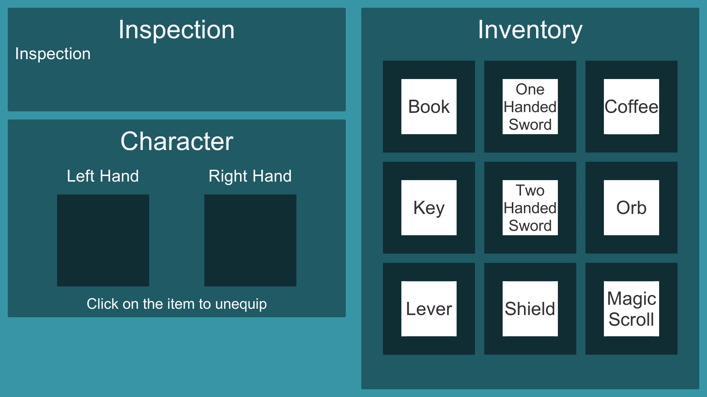

# Unity Inventory Sample
Very basic inventory system made with Unity 2021.3.5f1

# Inventory view

# Interactions

Green means both items can be equipped at the same time. Since two handed sword already occupy two slot, I colored it green.

# Features
- Basic and equippable items
- Item database system with scriptable objects
- Equip items to player slots (Checks if item can be placed within rules)
- Item group system to easily check if both items can be equip at the same time

# How To Add New Items
- Can be added with creating new scriptable objects (Right click/Create/Scriptables)
